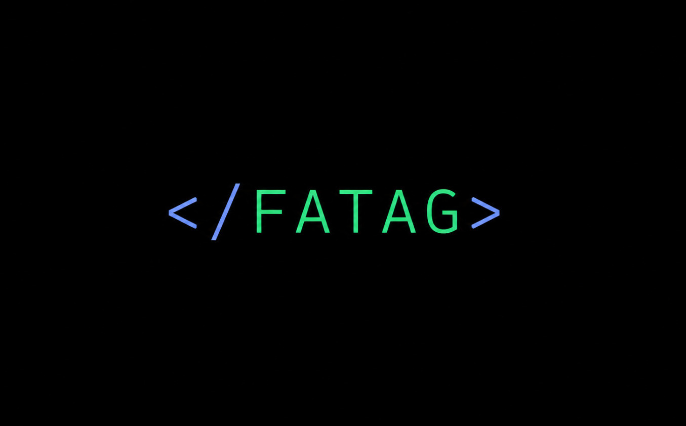

  

# </FATAG>

[Desafio](#-desafio) • [Backlog](docs/backlog.md) • [Sprints](#-sprints) • [Equipe](#-equipe)

> **Parceiro:** IPEM-SP · **Curso:** 3°ADS · **Período:** 2026-2
>
> **Status do Projeto:** Em desenvolvimento 🚧

---

## 🏭 Desafio

O IPEM-SP publica um grande volume de dados sobre a fiscalização de bombas medidoras de combustível, mas essa informação chega ao público em planilhas brutas, espalhadas entre o Portal de Dados Abertos do IPEM-SP e o PSIE do Inmetro. Os registros trazem inconsistências de nomes de municípios, formatos de data variados e colunas de medição sem padronização.

O resultado é um dado que existe, é público, mas não é consultável: o cidadão não consegue saber se as bombas da sua cidade estão em conformidade, e a própria gestão perde agilidade para identificar regiões críticas e padrões de reprovação.

Nesse contexto, o desafio é transformar essa base dispersa em informação clara, construindo um pipeline de tratamento e análise em Python e um painel web de consulta rápida sobre a conformidade das bombas de combustível fiscalizadas no estado de São Paulo.

---

## 📅 Sprints

| Sprint | Período | Meta | Documentação | Vídeo |
| :----- | :------ | :--- | :----------- | :---- |
| 🏃 **Sprint 1** | 07/09 – 27/09 | Consolidar os dados de fiscalização das bombas medidoras e disponibilizar os indicadores básicos de conformidade | [Docs](docs/sprints/sprint-1.md) | [Assistir](#) |
| 🏃 **Sprint 2** | 05/10 – 02/10 | Meta da sprint | [Docs](docs/sprints/sprint-2/backlog.md) | [Assistir](#) |
| 🏃 **Sprint 3** | 02/11 – 25/11 | Meta da sprint | [Docs](docs/sprints/sprint-3/backlog.md) | [Assistir](#) |

---

## 👥 Equipe

| Membro | Função | GitHub | LinkedIn |
| :----- | :----- | :----- | :------- |
| João Barreto | Product Owner |  |  |
| Nicolas Escobar | Scrum Master |  |  |
| Elizabete Baltazar | Desenvolvedor(a) |  |  |
| Heitor Galvão | Desenvolvedor(a) |  |  |
| Miguel Duarte | Desenvolvedor(a) |  |  |
| Lucas Suzuki | Desenvolvedor(a) |  |  |
| Kamille Fernandes | Desenvolvedor(a) |  |  |
| Adler Rocha | Desenvolvedor(a) |  |  |

---

FATAG · 3º ADS · Fatec São José dos Campos · 2026-2

